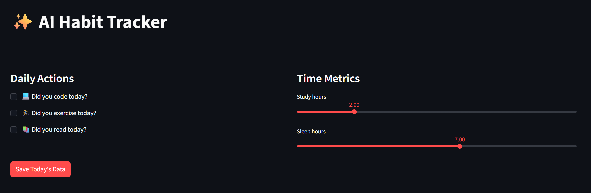
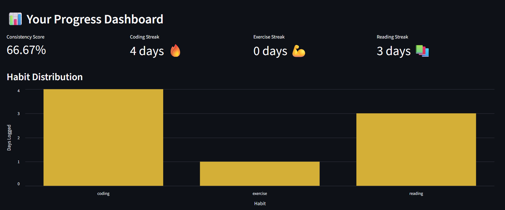
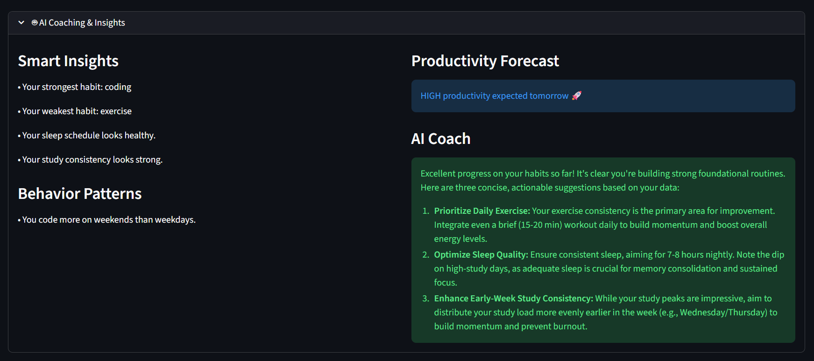

# ✨ AI Habit Tracker – Personal Productivity Analytics Dashboard


AI Habit Tracker is an intelligent productivity analytics dashboard that helps users monitor daily habits, analyze behavioral patterns, detect streaks, forecast productivity levels, and receive personalized coaching suggestions powered by Google Gemini AI.

The system combines behavioral analytics, statistical pattern detection, and generative AI to transform raw habit data into actionable productivity insights.

---

# 🚀 Features

## 📊 Habit Tracking Dashboard

Track daily:

- Coding activity
- Exercise activity
- Reading progress
- Study hours
- Sleep hours

Data stored locally using SQLite.

---

## 📈 Productivity Analytics Engine

Automatically calculates:

- Consistency Score
- Coding streak
- Exercise streak
- Reading streak
- Habit distribution visualization

Inspired by GitHub contribution tracking logic.

---

## 🧠 Behavior Intelligence Detection

Detects patterns like:

- weekday vs weekend productivity differences
- sleep impact on study performance
- strongest and weakest habits
- correlation-based behavior insights

Implemented using Pandas statistical analysis.

---

## 🔮 Productivity Forecast Engine

Predicts next-day productivity level:

- HIGH 🚀
- MODERATE 👍
- LOW ⚠️

Based on:

- recent coding activity
- study duration
- sleep hours
- streak continuity

---

## 🤖 AI Coaching Assistant (Gemini API)

Uses Google Gemini AI to generate:

- personalized productivity suggestions
- behavior improvement recommendations
- adaptive coaching insights

Includes:

- retry logic
- graceful API fallback handling
- environment-variable API key security

---

# 🖼️ Application Preview

## Habit Tracking Interface



Track daily habits including coding, exercise, reading, study hours, and sleep.

---

## Analytics Dashboard



Displays:

- consistency score
- streak metrics
- habit distribution charts
- productivity insights

---

## AI Coaching Assistant



Generates personalized behavioral insights using Google Gemini API.

---

# 🏗️ Architecture Overview
```
User Input (Streamlit UI)
↓
SQLite Storage Layer
↓
Pandas Analytics Engine
↓
Behavior Intelligence Modules
↓
Gemini AI Coaching Engine
↓
Interactive Dashboard Visualization
```

---

# ⚙️ Tech Stack

### Language

Python

### Frontend

Streamlit

### Database

SQLite

### Analytics Engine

Pandas

### Visualization

Altair

### AI Integration

Google Gemini API

### Environment Security

python-dotenv

---

# 📂 Project Structure
```
ai-habit-tracker/

├── app.py
├── analytics.py
├── database.py
├── ai_engine.py
├── data/
│ └── habits.db
├── assets/
│ ├── input-panel.png
│ ├── dashboard.png
│ └── ai-coach.png
├── .env
├── .gitignore
└── requirements.txt
```

---

# ⚡ Installation Guide

## 1️⃣ Clone repository

```
git clone https://github.com/BhaveshV23/ai-habit-tracker.git

cd ai-habit-tracker
```

---

## 2️⃣ Create virtual environment

Windows:
```
python -m venv .venv
.venv\Scripts\activate
```

Mac/Linux:
```
python3 -m venv .venv
source .venv/bin/activate
```

---

## 3️⃣ Install dependencies

```
pip install -r requirements.txt
```

---

## 4️⃣ Add Gemini API Key

Create `.env` file inside project root:

```
GEMINI_API_KEY=your_api_key_here
```

Get API key from:
```
https://aistudio.google.com/app/apikey
```
---

## 5️⃣ Run application

```
streamlit run app.py
```

App runs at:
```
http://localhost:8501
```

---

# 🧪 Engineering Highlights

This project demonstrates:

✔ modular Python architecture  
✔ SQLite persistence layer  
✔ behavioral scoring algorithm  
✔ streak detection logic  
✔ correlation-based analytics  
✔ productivity forecasting system  
✔ Gemini AI integration  
✔ retry logic with exponential backoff  
✔ environment-variable security handling  
✔ interactive Streamlit dashboard UI  

---

# 📌 Future Improvements

Planned enhancements:

- weekly trend visualization charts
- CSV export support
- authentication system
- cloud database deployment
- ML-based productivity prediction model
- mobile responsive layout
- habit reminder notification system

---

# 👨‍💻 Author

**Bhavesh Vadnere**  

Information Technology Engineering Student  

Interested in:

AI Engineering  
Data Analytics  
Machine Learning Systems  

---

# ⭐ If you found this project useful

Consider starring the repository!
